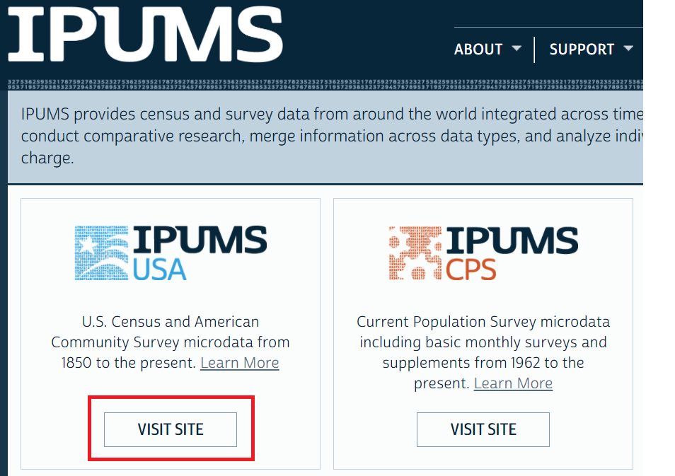
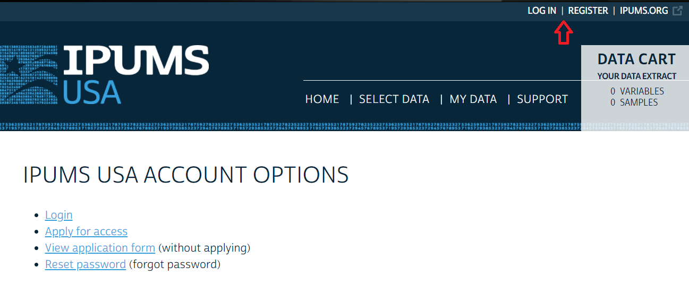
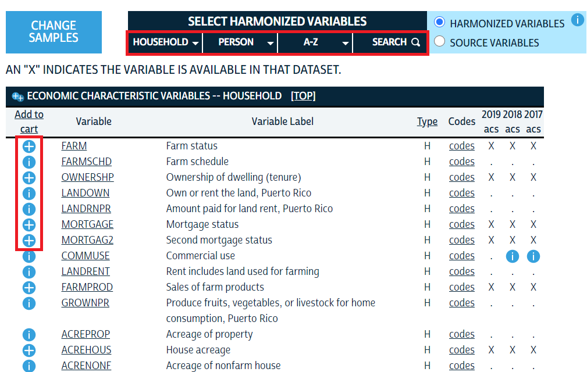
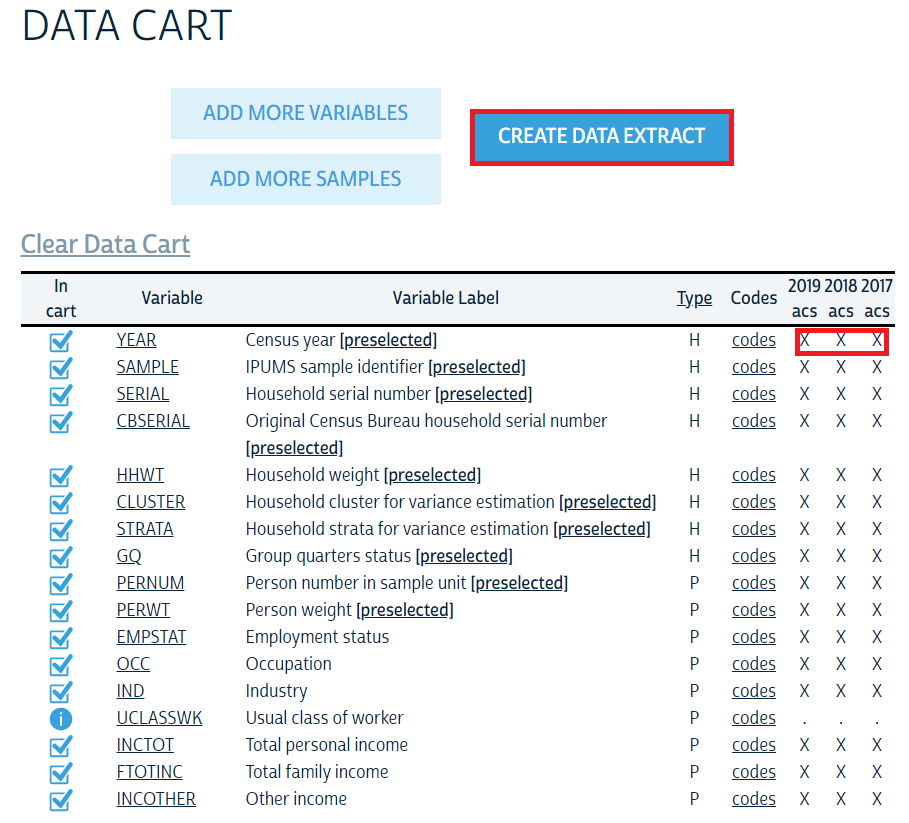
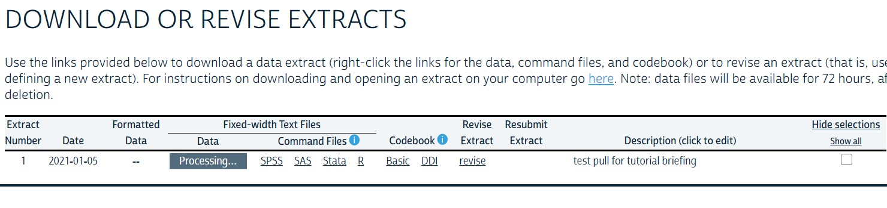

## Welcome to IPUMS: 
#### Integrated Public Use Microdata Series

Here you will find access to several different compilations of data such as the CPS (Current Population Survey) and the U.S. Census as well as health and housing data. The IPUMS system allows you to create a subset of these massive repositories of collected data that fits your needs and interests. An initial word of caution to those new to the system is that your requests aren't filled immediately, so START EARLY!


## Getting Started
To get started, let's walk through a data 'pull' from the U.S. census. Starting at the [IPUMS home page](https://ipums.org/), select the survey you wish to explore via the 'visit site' option. 


```{r, echo = FALSE}
# img width="360" height="200"

```


From here you will see a prompt to login or register at the very top of the widow: 

```{r, echo = F}
# img width="360" height="200"

```

If you have used IPUMS before, then you may proceed to login and move on to select your data, however if you are a new user you will need to apply for access. The register tab will ask you for standard account creation information - you should use your Harvard college email and indicate your usage accordingly. There are a handful of data use agreements you will be required to agree to in this process which you should note specifically with regard to citations. Once you have applied, you will need to await the confirmation of your account to log in fully. 

Once you have received the email confirmation and logged in properly, you will be able to begin the data selection process. The first option you will need to consider and specify will be the samples (see 'select samples' button), or time the period covered by your data. You will want to pay close attention to the intervals in this step as well as to note whether your pull will be a large sample or the entire available set (relevant in census applications). From there you can use the drop down menus and/or the search feature to locate and include the variables that you need or that may be relevant to your query. 

You can see below that the household and person tabs (highlighted) will provide a drop down of common variables from this repository under the respective classifications. To add a variable to your 'cart' you simply select the `+` icon, if not available either there is a corresponding explanation or it simply isn't available. 

```{r, echo = F}
# img width="360" height="200"

```

Once you are satisfied with the variables and intervals you have selected in your sample, you can review and revise your selections in the cart menu prior to requesting the 'pull'. Shown below is what the cart review window shows - an `X` indicates the existence of data in the given time period. Note that there is one variable with no data indicated by the `...` across the time period review columns.

<!-- <p align = "center"> -->
<!--    -->
<!-- </p> -->

```{r, echo = F}
# img width="360" height="360"

```

When you are satisfied with the sample specifications, you can proceed to the `create data extract` page. This will provide you with a handful of final options and a text window to describe the samply you've created. You should treat this like a commit message in GitHub - brief and meaningful. 

Submitting your request should automatically bring you to the request history page associated with your account. You will note that your requests are not permanently available here, and you should make sure to promptly download your information upon receipt so that you won't end up with an unnecessary delay. 

```{r, echo = F}
# img width="700" height="270"

```

Upon receiving the confirmation email for your request, return to the above window. You will need to first download the data via `Download.DAT`, then you will need to save the `DDI` link (via 'save as') in the <u>same location</u> as your `.dat.gz` file. Then select the `R` command file. The last step here will be to unpack / un-zip the `.dat.gz` file such that the `.gz` suffix is removed. The IPUMS [download instructions](https://usa.ipums.org/usa/extract_instructions.shtml) recommend [7-zip](http://www.7-zip.org/download.html) for those who don't already have file decompression software on hand. 

The `R` command file link will show you a text file containing roughly the following steps to unpack your data extraction: 


```{r include=T, eval=F, message=F}

if (!require("ipumsr")) stop("Reading IPUMS data into R requires the ipumsr package. It can be installed using the following command: install.packages('ipumsr')")

ddi <- read_ipums_ddi("path_to_your_file.xml")
data <- read_ipums_micro(ddi)

```


```{r data_import_cached, echo = F, eval=TRUE, include=F, cache=T}

if (!require("ipumsr")) stop("Reading IPUMS data into R requires the ipumsr package. It can be installed using the following command: install.packages('ipumsr')")

library(ipumsr)

ddi <- read_ipums_ddi("IPUMS/extracts/usa_00001.xml")
census1 <- read_ipums_micro(ddi)

```

A successful unpacking and proper saving of the `DDI` file should result in the ability to execute the code from the R command file as shown above. At this point you can access your 'Big Data' as you would any standard object. Below is an example extract from the U.S. census that I imported in the background. 

```{r, echo=F, include=F, message=F}
library(tidyverse)
```

```{r}
glimpse(census1)
```

## Additional Notes: 

* This data has `r nrow(data)` rows, so you may need to take care not to crash your machine by sampling the data initially or by working on the FAS cloud system. 

* You may also encounter problems pushing these large files to GitHub. See the large file storage options at [Git LFS](https://git-lfs.github.com/). 

* Some of the variables are 'haven labeled' see the [haven CRAN files](https://cran.r-project.org/web/packages/haven/haven.pdf) for more information on these. 

## Haven Labelled Variables:

If we look closely at the glimpse of our census data above you will notice that there are few columns with the `r class(census1$SAMPLE)[1]` classification. This feature tends to be more useful for different software applications such as Stata, but while working in R we need to recast these variables into something more useful and convenient. The first few haven variables we see are `SAMPLE`, `OCC`(occupation), and `IND`(industry). Each of these have thousands of unique positions to recode, so ideally we want to be able to automate this. 

To create a labelled variable, see `haven::labelled()`, to manually recode an existing case, we would employ `dplyr::recode()`. To reassign labels as the discrete column value, check out [the sjlabelled package] for base case recoding examples. Here is an example: 


```{r, eval=F, echo=T}

# currently exploring this package - the previous work done on haven labelled stuff was worked around because we wanted to keep the numeric factors... the replacement of the factors with the labels is proving to be more interesting than anticipated. 

library(sjlabelled)
library(tidyverse)

test <- census1 %>% 
  select(SAMPLE)

test1 <- test %>% 
  mutate(samp = get_labels(SAMPLE))

labels <- get_labels(test$SAMPLE)


# t <- t %>% 
#   mutate(occ = haven::labelled(OCC = integer(), .keep_value_labels = T))

```

